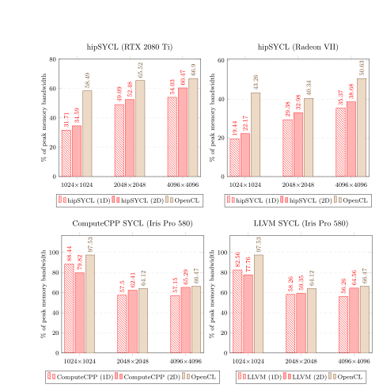

# A Performance Evaluation of the SYCL Programming Model

This project evaluated the performance portability of SYCL, a new parallel programming model developed and maintained by the Khronos consortium. SYCL is built on top of the low-level abstraction layer of OpenCL and based on pure C++, enabling developers to write single source code for heterogeneous processors while being able to use standard ISO C++11 features, such as inheritance, templating and namespaces.

The research hypothesis was that, as a high-level heterogeneous model, SYCL can achieve comparable performance to OpenCL, whilst also offering the convenience of using C++ abstractions and a less verbose single source style, therefore lowering the overall complexity of heterogeneous programming in comparison to other similar models. The conclusion was that — in most cases — SYCL is capable of attaining similar performance to OpenCL. In the case of the neutral mini-app, the performance of the SYCL implementation was comparable with the OpenMP version and often surpassed the performance of Kokkos.

The [complete dissertation can be read here](A_Performance_Evaluation_of_the_SYCL_Programming_Model.pdf). The source code for the lattice-boltzmann implementations is available in [this repository](https://github.com/AndreiCNitu/HPC). Some of the results obtained on GPUs are shown below as a reference comparison between SYCL and OpenCL.

---
### Lattice-Boltzmann GPU comparison

